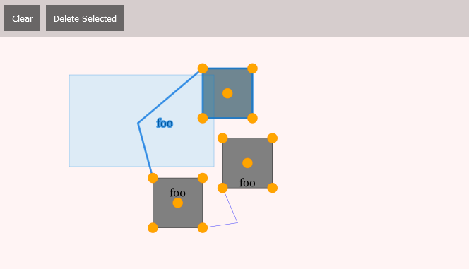

# SQL.js + Canvas UI Experiment

This is an experiment to implement a simple drawing application with HTML, Canvas, SVG and SQL.js

The goal is to implement most of the business logic in SQLite and render the output onto a canvas.
The Javascript should merely be use clue code between SQlite and the canvas (or SVG).